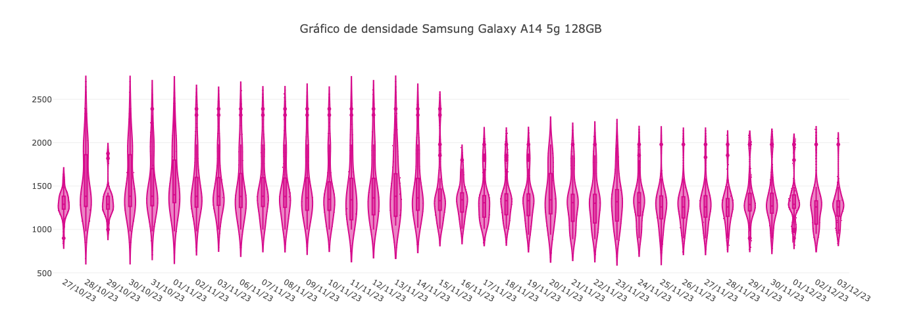
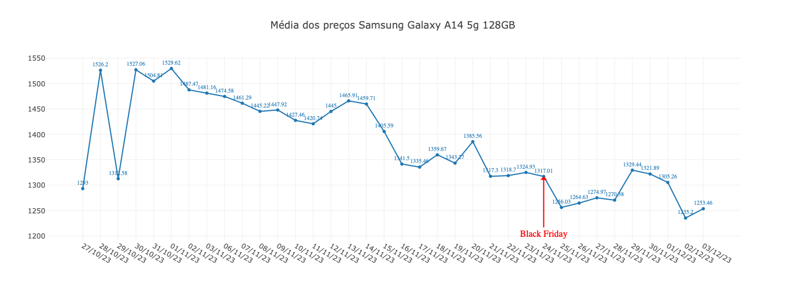
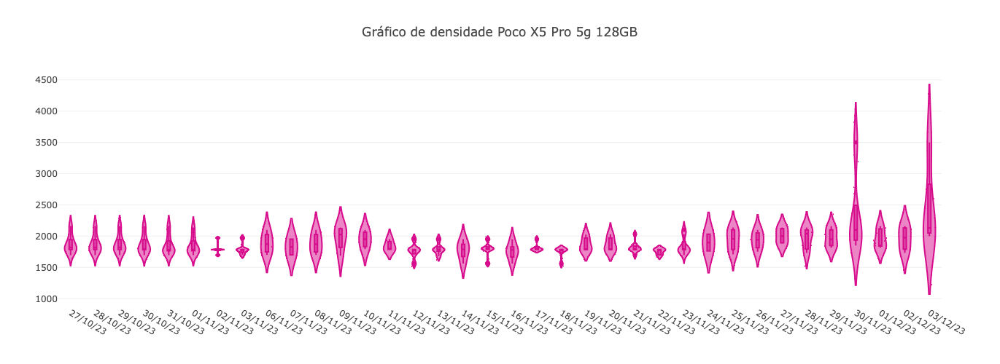
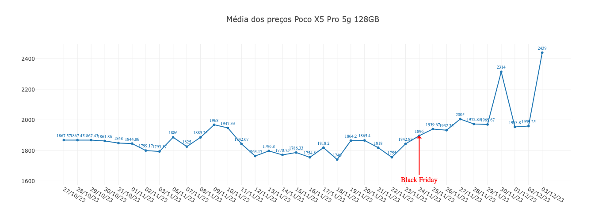
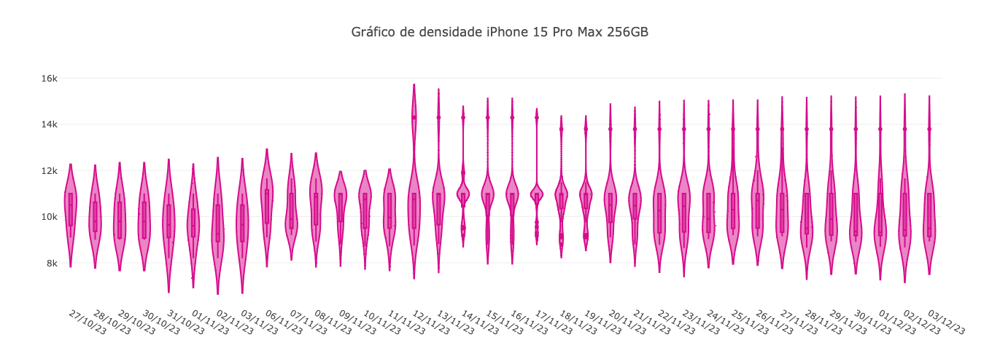
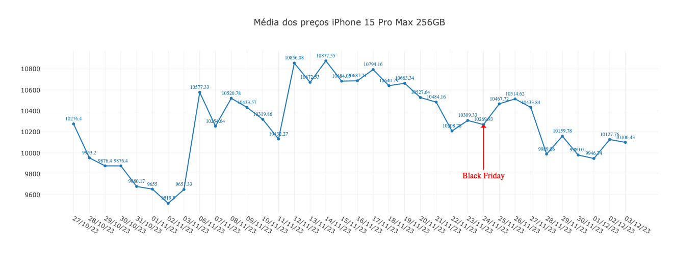

# Black Friday 2023 🔥
Um projeto para analisar os preços de produtos até o dia da Black Friday

## Introdução
Projeto iniciado em 24 de outubro com o objetivo de monitorar os preços de determinados produtos e verificar o quanto eles caíram até o dia da Black Friday que ocorre no dia 24 de novembro.

## Motivação
Preciso comprar um celular novo e quero aproveitar as promoções 😆

## Qual é o plano? 🤔
O plano é o seguinte:
1. Determinar os produtos que eu quero monitorar
2. Definir quais dados eu preciso obter
3. Escolher uma plataforma de e-commerce
4. Criar um script para obter os dados
5. Instalar esse script em um servidor para coletar os dados todos os dias
6. Transformar os dados em informação de forma gráfica
7. Analisar os resultados
8. Comprar o celular

## 1. Determinar os produtos que eu quero monitorar
Resolvi monitorar três celulares:

- Samsung Galaxy A14
- Xiaomi Pocophone Poco X5 Pro
- iPhone 15 Pro Max

## 2. Definir quais dados eu preciso obter
- Data da coleta dos dados
- Preço

## 3. Escolher uma plataforma de e-commerce
Escolhi o Mercado Livre porque já fiz um script no passado para coletar alguns dados, então posso reutilizar algumas partes do código

## 4. Criar um script para obter os dados
Fiz um [notebook](https://github.com/eduardoseity/black-friday-2023/blob/25adf949d66ce454b93fe4820182dfdc583e39e3/notebooks/BlackFriday_Sketch_2023.ipynb) no Google Colab para testar de forma rápida as funções necessárias para o script.

Com base nos testes desenvolvi o script [BlackFriday2023.py](https://github.com/eduardoseity/black-friday-2023/blob/25adf949d66ce454b93fe4820182dfdc583e39e3/BlackFriday2023.py) para coletar os dados. Este script faz a consulta dos produtos pré selecionados e salva os resultados em um DataFrame do pandas.

`busca.json` contém os produtos a serem pesquisados
```json
[
    {
        "url":"https://url.da.busca",
        "palavras_chaves":["Samsung Galaxy A14","5g","128GB"]
    },
    {
        "url":"https://url.da.busca",
        "palavras_chaves":["Poco X5 Pro","5g","128GB"]
    }
]
```
`url`: faça a busca pelo produto utilizando o campo de busca do site, copie a url e cole neste campo
<br>
`palavras_chaves`: este é um campo que contém as palavras que serão utilizadas para refinar a busca, se faz necessário por conta da variedade de produtos que a busca retorna. Utilizando essas palavras chaves fazemos um filtro para garantir que os resultados sejam mais próximos do produto desejado

`datasets/dados_coletados.csv` contém os resultados obtidos
Este arquivo é gerado automaticamente na primeira vez que o script é executado, a partir daí os resultados são adicionados a esse arquivo.

## 5. Instalar esse script em um servidor para coletar os dados todos os dias
Para rodar o script utilizei um Raspberry Pi 3 rodando o Ubuntu Server 23.04.
<br>Clonei este repositório em uma pasta e configurei a execução diária do script utilizando o `crontab` que é um recurso capaz de executar comandos agendados dentro do sistema.
Este [link](https://guialinux.uniriotec.br/crontab/)<sup>[1]</sup> possui uma explicação sobre o funcionamento deste recurso.

Adicionei um servidor Flask ao código `flask/app.py`<br>
Então podemos rodar o comando abaixo:
> python3 app.py


E consumir os dados utilizando

> https://localhost:4000/getData

Que vai retornar um json com todos os dados coletados até o momento

Para ajudar na visualização dos dados acrescentei mais duas formas de obter os resultados de forma sumarizada

> https://localhost:4000/getSummarizedData?reference=nome_da_referência

Isso retorna apenas os dados da referência indicada agrupados por data.<br>
Por exemplo, se eu utilizar `http://localhost:4000/getSummarizedData?reference=Samsung%20Galaxy%20A14%205g%20128GB` vou receber como resposta um json contendo apenas informações do `Samsung Galaxy A14 5g 128GB` agrupado pela data da coleta dos dados
```
[
   {
      "27/10/23": [
         {
            "Data": "27/10/23",
            "Link": "https://www.mercadolivre.com.br/samsung-galaxy-a14-exynos-5g-dual-sim-128-gb-verde-lima-4-gb-ram/p/MLB22096078?pdp_filters=category:MLB1055#searchVariation=MLB22096078&position=1&search_layout=stack&type=product&tracking_id=d3873266-edf7-4959-96c9-3eb56c61dd88",
            "Preço": 899,
            "Referência": "Samsung Galaxy A14 5g 128GB",
            "Título": "Samsung Galaxy A14 (Exynos) 5G Dual SIM 128 GB verde-lima 4 GB RAM",
            "id": "MLB3380804905"
         },
         {
            "Data": "27/10/23",
            "Link": "https://www.mercadolivre.com.br/smartphone-samsung-galaxy-a14-5g-128gb-4gb-ram-tela-66/p/MLB22432319?pdp_filters=category:MLB1055#searchVariation=MLB22432319&position=2&search_layout=stack&type=product&tracking_id=d3873266-edf7-4959-96c9-3eb56c61dd88",
            "Preço": 1045,
            "Referência": "Samsung Galaxy A14 5g 128GB",
            "Título": "Smartphone Samsung Galaxy A14 5g, 128gb, 4gb Ram, Tela 6.6",
            "id": "MLB4145394534"
         },
         {
            "Data": "27/10/23",
            "Link": "https://produto.mercadolivre.com.br/MLB-3504254580-samsung-galaxy-a14-5g-tela-66-octa-core-128gb4gb-ram-preto-_JM?searchVariation=177492200000#searchVariation=177492200000&position=14&search_layout=stack&type=item&tracking_id=d3873266-edf7-4959-96c9-3eb56c61dd88",
            "Preço": 1309,
            "Referência": "Samsung Galaxy A14 5g 128GB",
            "Título": "Samsung Galaxy A14 5g Tela 6.6 Octa Core 128gb/4gb Ram Preto",
            "id": "MLB3504254580"
         },
         ...
```

Outra possibilidade é utilizar
> http://localhost:4000/getMeanData?reference=nome_da_referência

Isso vai retornar um json tembém agrupado por data, porém contendo a média dos preços coletados.

Para rodar esse servidor automaticamente toda vez que ele cair ou o sistema for reiniciado é preciso criar um serviço e registrá-lo.<br>
[Aqui](https://www.shubhamdipt.com/blog/how-to-create-a-systemd-service-in-linux/)<sup>[2]</sup> está um bom tutorial de como fazer isso em Linux.

## 6. Transformar os dados em informação de forma gráfica
Após vários dias coletando dados montei dois gráficos principais para cada modelo de celular.<br>
O primeiro é um gráfico de `violino` combinado com um `boxplot` ele demonstra a densidade dos dados e a sua distribuição, a partir dele eu posso verificar rapidamente os valores máximos e mínimos, a mediana e também os seus quartis. A figura do `violino` nos ajuda a enxergar onde os dados são mais densos, ou seja, em quais partes do eixo y (preço) os dados estão mais concentrados.<br>
Neste [link](https://medium.com/data-hackers/violinplot-uma-arma-poderosa-e-elegante-para-análise-de-dados-e83ba72da801)<sup>[3]</sup> você encontra um ótimo artigo que explica os gráficos de `violino` e `boxplot` bem como a utilização dos dois em conjunto.
<br>
O segundo gráfico mostra a média dos preços em cada dia. É um gráfico de `linha` bem simples, mas vai nos ajudar a saber se a média de preço de determinado produto subiu ou caiu ao longo do tempo.

<b>Plotly</b><br>
A biblioteca `plotly` é uma ótima ferramenta de visualização. Ela oferece mais de 40 tipos de gráficos, incluindo gráficos 3D e mapas, customizáveis e interativos. `Plotly` pode ser utilizado com `python`, `javascript`, `R` e outras linguagens de programação.

Para este exemplo utilizei a biblioteca `plotly.js` que permite montar uma página simples em `html` e utilizar `javascript` para construir os gráficos.

O arquivo `html/index.html` possui uma caixa de seleção contendo os produtos pesquisados e ao selecionar um deles os gráficos são atualizados. Como os dados são obtidos do servidor `flask` é necessário que o servidor esteja rodando ao utilizar a página.

Estes foram os resultados obtidos.<br>
<br>
<br>
<br>
<br>
<br>
<br>
## 7. Analisar os resultados
Em andamento...
## 8. Comprar o celular
Em andamento...

## Tecnologias utilizadas


## Referências
[1] https://guialinux.uniriotec.br/crontab/<br>
[2] https://www.shubhamdipt.com/blog/how-to-create-a-systemd-service-in-linux/<br>
[3] https://medium.com/data-hackers/violinplot-uma-arma-poderosa-e-elegante-para-análise-de-dados-e83ba72da801

### Keep in touch
- https://www.github.com/eduardoseity
- https://www.linkedin.com/in/eduardo-seity-iseri-15908224
- eduardoseity@hotmail.com
